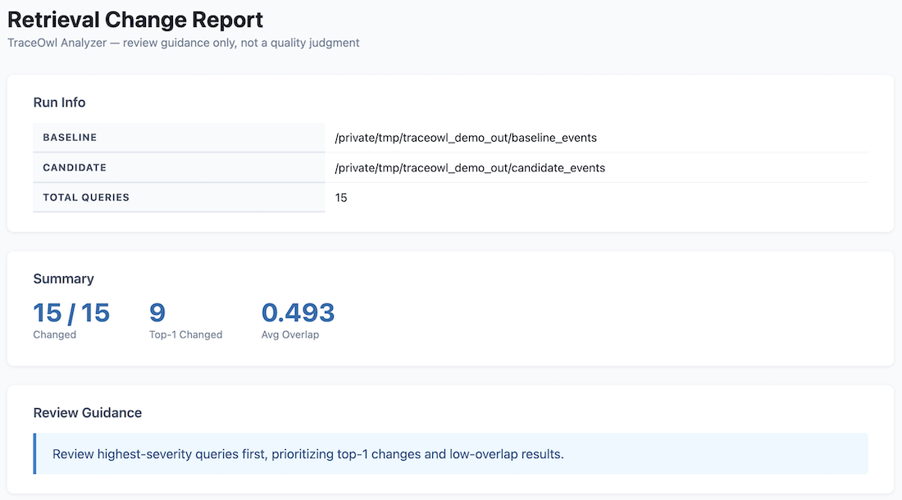
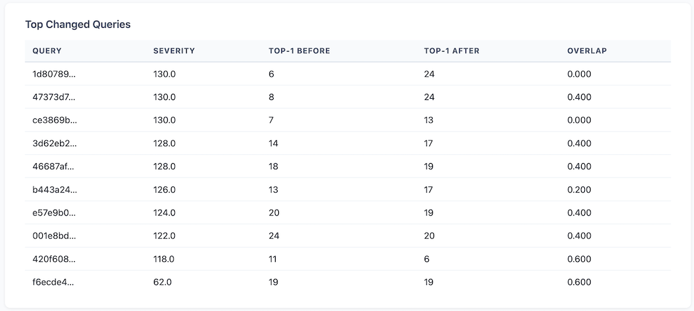
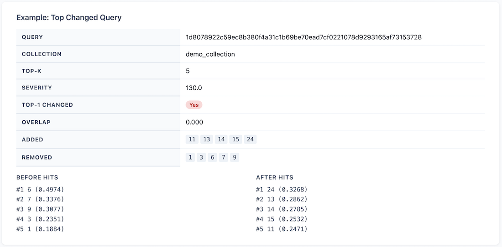

# TraceOwl

**Understand how your retrieval changes.**

TraceOwl is an observability tool for retrieval systems.

It captures, compares, and explains differences in VectorDB search results so you can quickly understand what changed and where to focus your review.

- Capture real retrieval queries via a proxy
- Compare before/after search results
- Show what changed (documents, ranking, scores)
- Highlight queries you should review first

---

## Example Report

A report showing what changed between two retrieval runs.

### Summary & Guidance


### Top Changed Queries


### Example Diff


---

## Quickstart

### Prerequisites

- Your client application configured to use a VectorDB (e.g. Qdrant, Pinecone)
- A running VectorDB (Qdrant or Pinecone-compatible)
- Docker (optional, for running TraceOwl components)

### Step 1 - Start the proxy

The proxy sits in front of your vector DB and captures search events.

```bash
docker run -d --name traceowl-proxy \
  -v ./proxy.toml:/config.toml:ro \
  -v ./data:/data \
  traceowl-proxy /config.toml
```

**`proxy.toml`** (local mode):

```toml
backend           = "qdrant"
listen_addr       = "0.0.0.0:6333"
upstream_base_url = "http://localhost:6334"   # your vector DB
sampling_rate     = 1.0

[sink]
mode              = "local_only"
local_output_root = "/data"
```

The proxy exposes a control API at `http://localhost:6333/control/`.

Wait until it is ready:

```bash
curl http://localhost:6333/control/status
```

### Step 2 — Start tracing

```bash
curl -s -X POST http://localhost:6333/control/tracing/start \
  -H 'Content-Type: application/json' \
  -d '{"sampling_rate": 1.0}'
```

Response:

```json
{
  "status": "started",
  "session_id": "20260419T120000Z_a1b2c3"
}
```

Save the `session_id` — you will need it for the analyzer.

### Step 3 — Stop tracing

```bash
curl -s -X POST http://localhost:6333/control/tracing/stop \
  -H 'Content-Type: application/json'
```

Response:

```json
{
  "status": "stopped",
  "stopped_session_id": "20260419T120000Z_a1b2c3",
  "local_output_prefix": "events/20260419T120000Z_a1b2c3/",
  "remote_output_prefix": "events/20260419T120000Z_a1b2c3/",
  "upload_status": "not_configured"
}
```

In S3 mode, wait for `upload_status` to leave `"pending"` before proceeding — the proxy uploads files asynchronously after the session closes.


### Step 4 — Diff (Optional)

If you have the analyzer, you can skip this step and point it directly at the raw event files.

```bash
traceowl-diff \
  --baseline data/<baseline-session-id>/*.jsonl \
  --candidate data/<candidate-session-id>/*.jsonl \
  --output diff.jsonl
```

### Step 5 — Analyze

#### Analyze local files

```bash
docker run --rm \
  -v ./data:/data \
  traceowl-analyzer \  # no config needed for local files
  analyze \
  --baseline-dir /data/<baseline-session-id> \
  --candidate-dir /data/<candidate-session-id> \
  --output-html /data/report.html \
  --summary-json /data/summary.json
```
