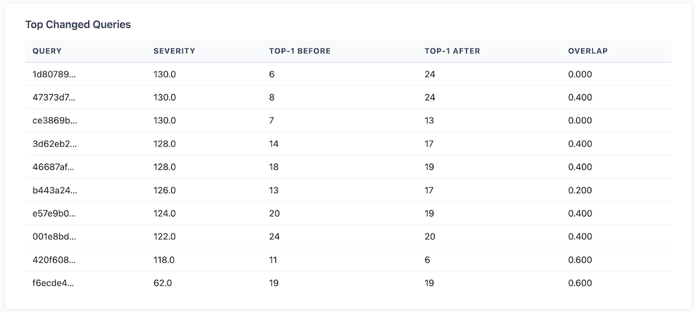
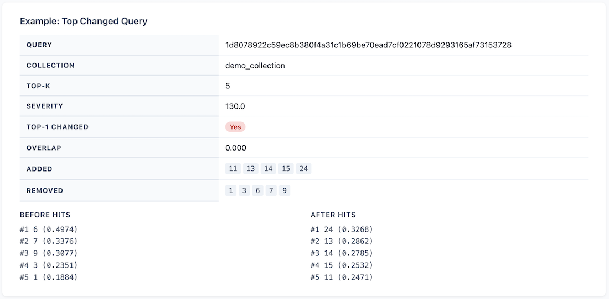

# TraceOwl

**Understand how your retrieval changes.**

TraceOwl captures, compares, and explains differences in VectorDB search results so you can quickly understand what changed and where to focus your review.

---

## Example Report

A report showing what changed between two retrieval runs.

### Summary & Guidance


### Top Changed Queries


### Example Diff


---

## What it does

- Capture real retrieval queries via a proxy
- Compare before/after search results
- Show what changed (documents, ranking, scores)
- Highlight queries you should review first

---

## Why

Retrieval systems change frequently; embeddings, ranking logic, filters, and indexing strategies evolve.

But understanding *how* those changes affect results is difficult.

TraceOwl helps you:

- Detect unintended retrieval changes
- Understand ranking differences
- Identify high-impact queries quickly
- Review changes efficiently

---

## How it works

```
Client → Proxy → VectorDB
               ↓
            JSONL logs
               ↓
         traceowl-diff
               ↓
           analyzer
               ↓
           HTML report
```

---

## Components

- **traceowl-proxy**  
  Transparent proxy that captures queries and responses

- **traceowl-diff**  
  Computes differences between retrieval results

- **traceowl-analyzer (commercial)**  
  Advanced analysis and generates human-readable HTML reports

---

## Usage

### Prerequisites

- Rust toolchain (1.80+) — [rustup.rs](https://rustup.rs)
- A running VectorDB (Qdrant or Pinecone-compatible)

---

### Build binaries

```bash
# Build both binaries from the workspace root
cargo build --release -p traceowl-proxy -p traceowl-diff

# Binaries land at:
#   target/release/traceowl-proxy
#   target/release/traceowl-diff
```

---

### Build Docker image

```bash
docker build -f crates/traceowl-proxy/Dockerfile -t traceowl-proxy .
```

---

### Run traceowl-proxy

**1. Create a config file**

Copy the example and edit to match your setup:

```bash
cp config.example.toml config.toml
```

Key fields:

```toml
backend = "qdrant"                        # "qdrant" or "pinecone"
listen_addr = "0.0.0.0:6333"             # port your clients connect to
upstream_base_url = "http://localhost:6334"  # your real VectorDB
sampling_rate = 0.1                       # fraction of requests to record
output_dir = "./events"                   # where JSONL files are written
```

**2a. Run the binary**

```bash
./target/release/traceowl-proxy config.toml
```

**2b. Run with Docker**

```bash
docker run -d \
  -p 6333:6333 \
  -v $(pwd)/config.toml:/config.toml \
  -v $(pwd)/events:/events \
  traceowl-proxy:latest /config.toml
```

**3. Start a tracing session**

Tracing is off by default. Start it when you want to capture events:

```bash
curl -s -X POST http://localhost:6333/control/tracing/start \
  -H 'Content-Type: application/json' \
  -d '{"sampling_rate": 0.1}' | jq .
```

Point your application at the proxy instead of the VectorDB directly and run
your queries as normal. The proxy forwards all traffic transparently.

**4. Stop tracing and flush events**

```bash
curl -s -X POST http://localhost:6333/control/tracing/stop | jq .
```

This flushes any buffered events to disk before returning. Event files appear
in `output_dir` as `events-<session-id>-<seq>.jsonl`.

**Check status at any time**

```bash
curl -s http://localhost:6333/control/status | jq .
```

---

### Run traceowl-diff

Compare two sets of event files (e.g. before and after an embedding change):

```bash
./target/release/traceowl-diff \
  --baseline events/baseline/events-*.jsonl \
  --candidate events/candidate/events-*.jsonl \
  --output diff.jsonl
```

The output `diff.jsonl` contains one record per matched query hash showing what
changed between the two retrieval runs. Feed it into traceowl-analyzer to
generate an HTML report.

---

## Quickstart (conceptual)

1. Run `traceowl-proxy`
2. Send queries through the proxy
3. Collect event logs
4. Run `traceowl-diff`
5. Generate HTML report with analyzer

---

## Design Principles

- **Diff first, judgment later**  
  TraceOwl shows what changed - not whether it's good or bad

- **Human-in-the-loop**  
  Focus on helping engineers review changes efficiently

- **Deterministic and explainable**  
  No black-box scoring — all differences are traceable

---

## Status

Early-stage project. Core pipeline is working:

- Proxy → Diff → Analyzer → Report

Actively evolving.
